# COAN System Architecture

Canadian Observers and Activists Network (COAN)

Version: MVP and production architecture plan

## 1. Executive Summary

COAN is a nonprofit digital platform for Chinese-speaking newcomers in Canada. The system helps users understand Canadian society, public services, community rules, public policy, civic engagement, student support, and practical settlement topics such as housing, healthcare, tax, and benefits.

The current implementation is a demo-ready MVP with:

- A Next.js public website.
- Static content-driven pages for resources, events, volunteer matching, community posts, and chatbot UX.
- A FastAPI chatbot backend foundation.
- A LangGraph workflow scaffold for topic classification, context retrieval, and answer generation.
- A Supabase Postgres schema with row-level-security policies.
- A design-token and branding foundation.

The production architecture extends the MVP into a secure, maintainable platform using:

- Supabase Auth for user and admin authentication.
- Supabase Postgres for operational data.
- Supabase Storage for files, images, event media, and resource attachments.
- FastAPI on Render for chatbot, AI workflow orchestration, and protected backend operations.
- LangGraph for AI workflow control.
- A vector database and RAG pipeline for source-grounded answers.
- Evaluation, analytics, and admin review systems for safety and continuous improvement.
- Vercel for frontend deployment.
- Render for backend deployment.

## 2. Architecture Goals

### Product Goals

- Provide trustworthy public-service information.
- Support bilingual-ready newcomer resources.
- Enable volunteer and mentor matching workflows.
- Offer moderated community discussion.
- Provide a careful AI assistant for general information.
- Support admin review and content operations.

### Engineering Goals

- Keep frontend and backend concerns separate.
- Use strict role-based access control.
- Avoid exposing service-role keys or AI API keys in the frontend.
- Make future RAG, analytics, evaluation, and admin workflows easy to add.
- Preserve user consent for chatbot logging and volunteer applications.
- Keep data models understandable for future engineers.

## 3. Current MVP Architecture

The MVP is intentionally lightweight and demo-ready. It shows the final product shape while keeping integrations staged.

### Current Components

| Layer | Technology | Current Role |
| --- | --- | --- |
| Frontend | Next.js App Router, TypeScript, Tailwind CSS | Public pages, forms, admin dashboard surface, branding |
| Content | TypeScript content registry | Demo-ready page content, resources, events, posts, volunteer roles |
| Design system | CSS variables, TypeScript design tokens | Shared brand colors, spacing, typography, component rules |
| Backend | FastAPI | `/health` and `/chat` API foundation |
| AI layer | LangGraph | Basic workflow: classify topic, retrieve context, generate response |
| Database | Supabase Postgres schema | Tables and RLS policies drafted in SQL |
| Auth | Supabase Auth schema dependency | Profiles reference `auth.users`; frontend auth not wired yet |
| Storage | Supabase Storage | Planned for uploaded resource media and documents |
| Deployment | Vercel and Render | Target deployment platforms |

### Current MVP Component Diagram

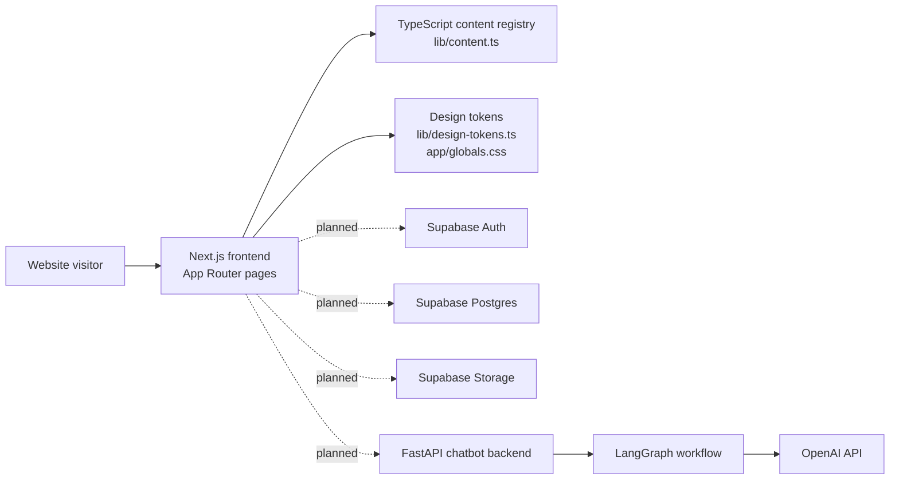

### Current MVP File Map

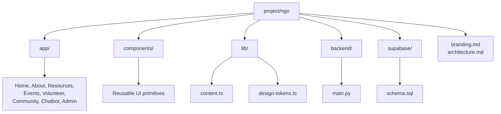

## 4. Future Production Architecture

The production version separates public browsing, authenticated user workflows, admin operations, and AI workflows.

### Production Architecture Diagram

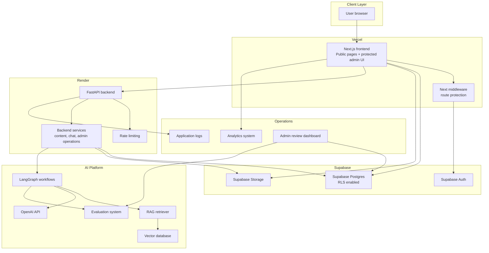

## 5. Frontend Architecture

### Technology

- Next.js App Router.
- TypeScript.
- Tailwind CSS.
- Reusable UI primitives.
- Design tokens in `lib/design-tokens.ts`.
- Public pages and protected admin pages.

### Frontend Responsibilities

- Render public information pages.
- Provide accessible forms for volunteer, event, community, and chatbot workflows.
- Manage client-side navigation and responsive layout.
- Use Supabase Auth session state.
- Call Supabase with anon key under RLS protection.
- Call FastAPI for chatbot requests and backend-only operations.
- Never expose service-role keys or OpenAI API keys.

### Frontend Route Model

| Route | Purpose | Production Data Source |
| --- | --- | --- |
| `/` | Public homepage | CMS/resources/events summary |
| `/about` | Mission and organization | Static or CMS |
| `/resources` | Resource portal | Supabase `resources`, vector indexing metadata |
| `/events` | Event list | Supabase `events` |
| `/events/[slug]` | Event detail and registration | Supabase `events`, `event_registrations` |
| `/volunteer` | Volunteer and mentor applications | Supabase `volunteer_applications` |
| `/community` | Moderated posts and comments | Supabase `posts`, `comments` |
| `/chatbot` | AI information assistant | FastAPI `/chat`, Supabase consented logs |
| `/admin` | Protected admin dashboard | Supabase admin queries and backend services |

## 6. Backend Architecture

### Technology

- FastAPI.
- Pydantic request and response models.
- CORS configuration.
- Rate limiting.
- LangGraph orchestration.
- OpenAI API integration.

### Backend Responsibilities

- Own AI workflow execution.
- Protect AI API keys.
- Apply rate limits and abuse prevention.
- Retrieve curated content for RAG.
- Write consent-based chat logs.
- Run admin-only operations that require elevated permissions.
- Provide health checks for deployment monitoring.

### Backend API Surface

Current:

| Endpoint | Method | Purpose |
| --- | --- | --- |
| `/health` | GET | Deployment and uptime health check |
| `/chat` | POST | Chatbot question handling |

Production:

| Endpoint | Method | Purpose |
| --- | --- | --- |
| `/chat` | POST | Run LangGraph chat workflow |
| `/chat/sessions` | GET | Admin-only consented session review |
| `/admin/matches` | POST | Create manual mentor and mentee match |
| `/admin/moderation` | PATCH | Moderate posts and comments |
| `/ingest/resources` | POST | Admin-only resource ingestion for RAG |
| `/eval/chat-runs` | POST | Store AI evaluation records |

## 7. AI Layer Architecture

### Current LangGraph Workflow

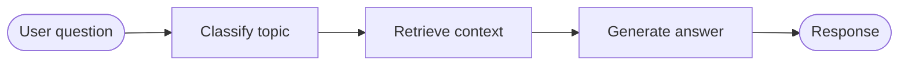

Current behavior:

- Topic classification is keyword-based.
- Context retrieval is stubbed with a curated-content boundary and is ready to be replaced by the production RAG retriever.
- Answer generation uses OpenAI when `OPENAI_API_KEY` is configured.
- Response includes topic, answer, suggested next steps, and disclaimer.

### Production LangGraph Workflow

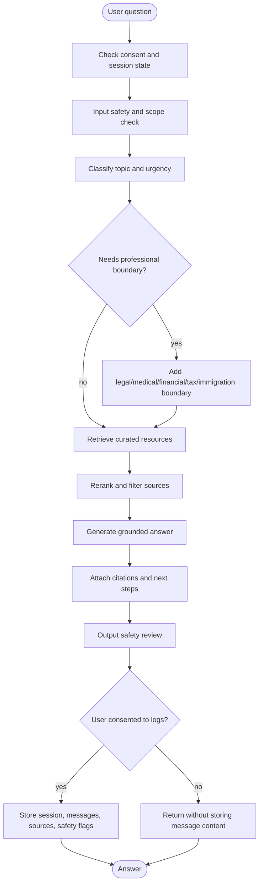

### AI Safety Principles

- The assistant provides general information only.
- It must not provide definitive legal, medical, financial, tax, or immigration advice.
- High-risk questions should route users to official sources or qualified professionals.
- Chat logs are stored only when the user consents.
- Admin review should focus on safety flags, source quality, and recurring information gaps.

## 8. Database Architecture

### Supabase Postgres Tables

Current schema includes:

- `profiles`
- `volunteer_applications`
- `mentor_profiles`
- `mentee_profiles`
- `match_requests`
- `posts`
- `comments`
- `events`
- `event_registrations`
- `resources`
- `chat_sessions`
- `chat_messages`

### Entity Relationship Diagram

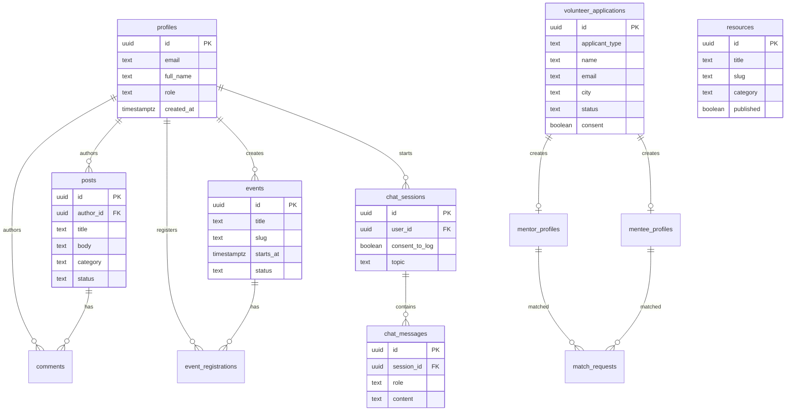

### RLS Strategy

Core policy model:

- Public users can read published events and resources.
- Authenticated users can create posts and comments.
- Users can edit their own posts.
- Admins can manage resources, events, volunteer applications, matching records, moderation, and consented chatbot logs.
- Chat messages are visible to admins only when the chat session has logging consent.
- Volunteer applications require consent on insert.

## 9. Storage Architecture

### Supabase Storage Buckets

Recommended buckets:

| Bucket | Access | Purpose |
| --- | --- | --- |
| `public-assets` | Public read | Logos, static images, event banners |
| `resource-files` | Public or signed read | Resource PDFs, translated guides, downloadable checklists |
| `event-media` | Public or signed read | Event images, slides, workshop recordings |
| `admin-uploads` | Admin only | Draft documents, internal review files |
| `profile-documents` | Restricted | Volunteer verification or sensitive supporting documents, if ever needed |

Storage rules:

- Use signed URLs for private or restricted files.
- Keep public files separate from sensitive files.
- Do not store secrets or private identifiers in public buckets.
- Use file metadata to connect storage objects to `resources`, `events`, or admin records.

## 10. Authentication and Authorization

### Supabase Auth

Authentication model:

- Email login for users and admins.
- `profiles` table mirrors core user metadata.
- `profiles.role` controls `user` vs `admin`.
- RLS policies enforce database access.

### Role Model

| Role | Permissions |
| --- | --- |
| Public visitor | Read published resources/events, submit consent-based forms |
| Authenticated user | Create posts/comments, register for events, manage own profile |
| Volunteer | Same as authenticated user plus volunteer profile access |
| Admin | Manage content, events, applications, matching, moderation, consented logs |

### Protected Route Flow

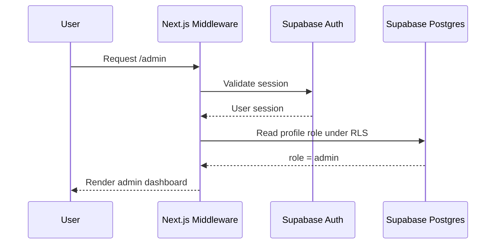

## 11. Data Flow Diagrams

### Resource Publishing Flow

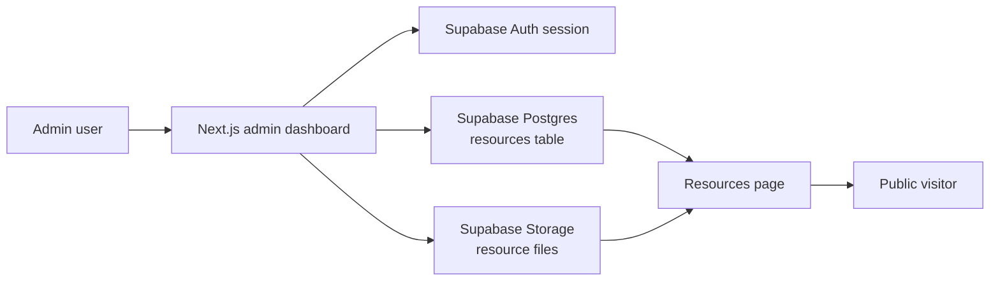

### Volunteer Matching Flow

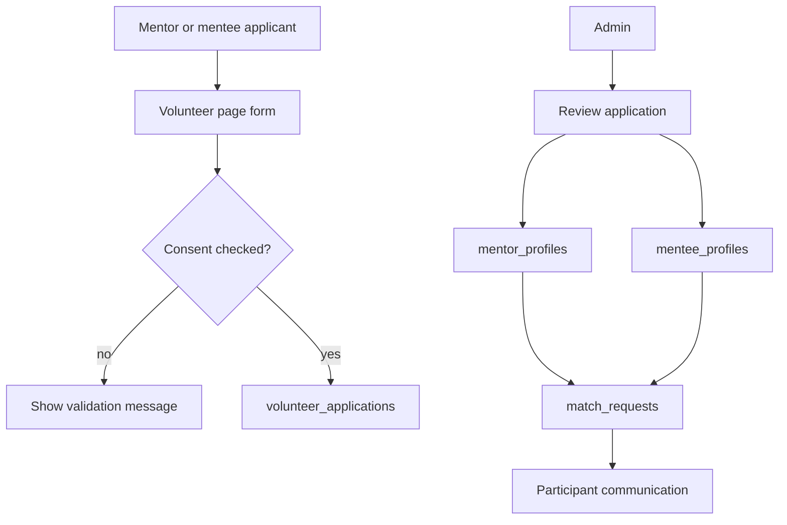

### Community Moderation Flow

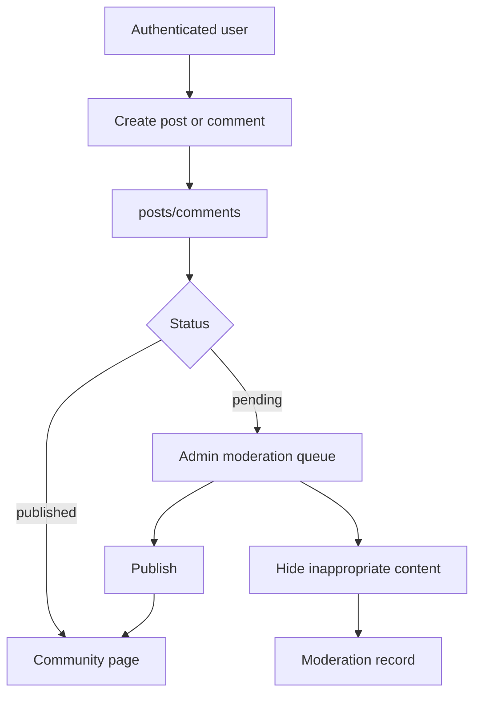

### Chatbot Data Flow

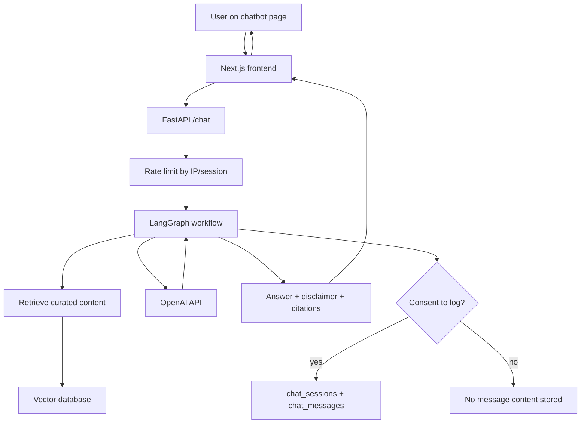

## 12. Sequence Diagrams

### Event Registration Sequence

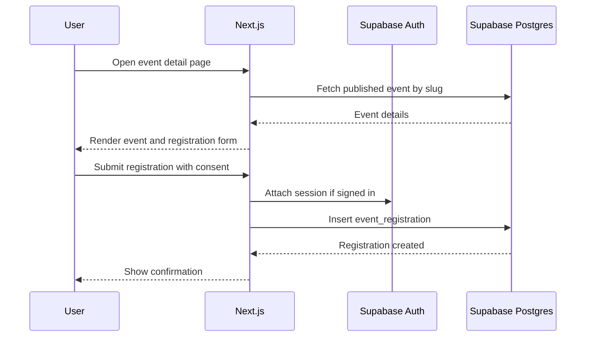

### Chatbot Sequence

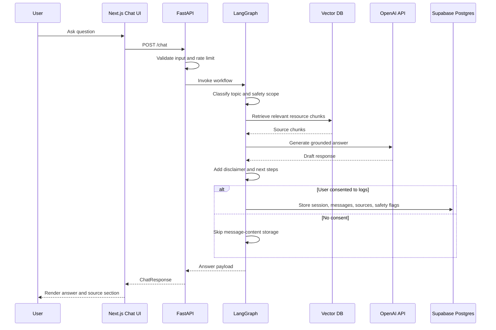

### Admin Resource Publishing Sequence

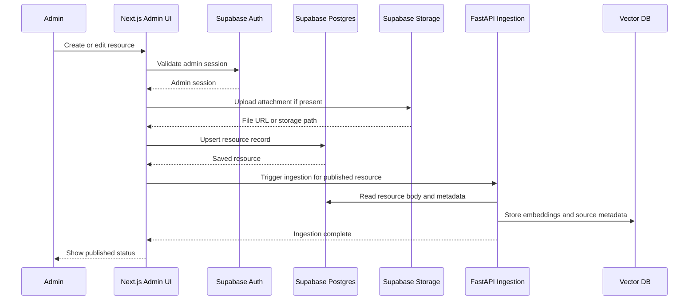

## 13. Deployment Architecture

### Deployment Diagram

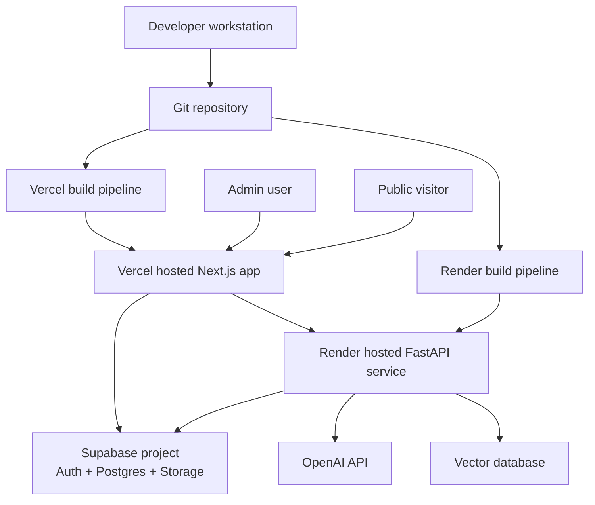

### Environment Variables

Frontend on Vercel:

- `NEXT_PUBLIC_SUPABASE_URL`
- `NEXT_PUBLIC_SUPABASE_ANON_KEY`
- `CHATBOT_API_URL`

Backend on Render:

- `OPENAI_API_KEY`
- `OPENAI_MODEL`
- `SUPABASE_URL`
- `SUPABASE_SERVICE_ROLE_KEY`
- `ALLOWED_ORIGINS`
- `RATE_LIMIT_PER_MINUTE`
- `VECTOR_DATABASE_URL`

Security rule:

Only `NEXT_PUBLIC_*` variables may be exposed to the browser. Service-role keys, OpenAI keys, and vector database credentials must remain backend-only.

## 14. Future Services

### Vector Database

Purpose:

- Store embeddings for published resources.
- Retrieve relevant passages for chatbot answers.
- Attach citations to AI responses.

Options:

- Supabase pgvector.
- Pinecone.
- Weaviate.
- Qdrant.

Recommended starting point:

- Supabase pgvector, because operational data already lives in Supabase and the team can keep infrastructure simple early.

### RAG Pipeline

Pipeline stages:

1. Admin publishes or updates resource.
2. Backend reads article body and metadata.
3. Text is cleaned and chunked.
4. Chunks are embedded.
5. Embeddings are stored with source metadata.
6. Chat workflow retrieves relevant chunks.
7. LLM generates answer grounded in retrieved content.
8. Response includes citations and official next steps.

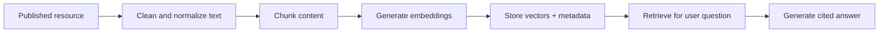

### Evaluation System

Purpose:

- Detect unsafe advice.
- Measure source citation quality.
- Track answer usefulness.
- Monitor topic coverage gaps.

Evaluation dimensions:

- Safety boundary followed.
- Source groundedness.
- Relevance.
- Clarity.
- Next-step quality.
- Language appropriateness.
- Refusal quality for high-risk advice.

### Analytics System

Metrics:

- Resource views by category.
- Event registrations.
- Volunteer application funnel.
- Community moderation volume.
- Chatbot topics.
- Chatbot consent rate.
- Search queries with no results.
- High-demand topics by city or audience segment.

Privacy rule:

Analytics should avoid storing unnecessary personal information and should aggregate sensitive usage patterns.

### Admin Dashboard

Admin dashboard modules:

- Resource CMS.
- Event management.
- Volunteer application review.
- Manual mentor and mentee matching.
- Community moderation.
- Chatbot usage logs.
- AI evaluation review.
- Analytics overview.

## 15. Security and Privacy Architecture

### Security Controls

- Supabase Auth for identity.
- Row Level Security on all sensitive tables.
- Service-role key used only by backend.
- Rate limiting for chatbot endpoint.
- CORS restricted to allowed frontend origins.
- Consent required for volunteer applications, event registrations, and chatbot logs.
- Admin-only review of sensitive records.
- No OpenAI API key in frontend.

### Privacy Controls

- Store chatbot logs only when user consents.
- Avoid collecting sensitive identity, immigration, medical, or financial details unless necessary.
- Use retention rules for inactive applications and old chat logs.
- Use moderation for community content that may expose private details.
- Keep audit logs for admin actions in production.

## 16. Reliability and Observability

### Reliability Practices

- Health endpoint for backend.
- Build checks in CI.
- TypeScript checks for frontend.
- Database migrations reviewed before release.
- Feature flags for AI workflow changes.
- Graceful fallback when AI service is unavailable.

### Observability

Frontend:

- Page errors.
- Route performance.
- Form submission errors.

Backend:

- Request count.
- Latency.
- Rate-limit hits.
- AI provider errors.
- Retrieval failures.

AI:

- Topic distribution.
- Safety flags.
- Evaluation failures.
- Citation coverage.

## 17. Interview Talking Points

This architecture demonstrates:

- Full-stack system design with clear separation of frontend, backend, AI, and data layers.
- Practical security through Supabase Auth, RLS, backend-only service keys, and consent-aware logging.
- Production-minded AI architecture using LangGraph, RAG, citations, evaluation, and admin review.
- Maintainable frontend architecture with reusable components, centralized content, and design tokens.
- Nonprofit/public-service product thinking: accessibility, privacy, moderation, trust, and source-oriented information.
- Scalable deployment model using Vercel, Render, Supabase, and a vector database.

## 18. Implementation Roadmap

### Phase 1: Current MVP

- Public pages.
- Demo content.
- Branding system.
- Architecture documentation.
- Supabase schema.
- FastAPI and LangGraph chatbot foundation.

### Phase 2: Auth and CMS

- Supabase Auth.
- Protected admin dashboard.
- Resource CMS.
- Event management.
- Volunteer application storage.

### Phase 3: Community and Matching

- Authenticated posts and comments.
- Moderation workflow.
- Mentor and mentee profiles.
- Manual matching.

### Phase 4: AI Productionization

- RAG ingestion.
- Vector database.
- Citation-aware chat responses.
- Consent-based chat logs.
- Evaluation records.

### Phase 5: Operations

- Analytics dashboard.
- Admin audit logs.
- Monitoring and alerts.
- Content quality workflow.
- Deployment hardening.
