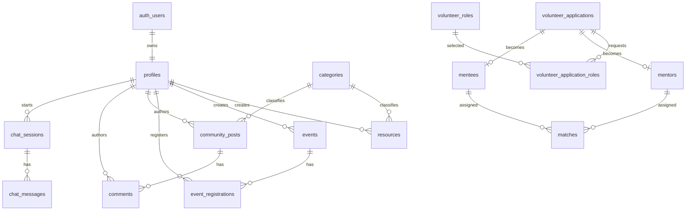
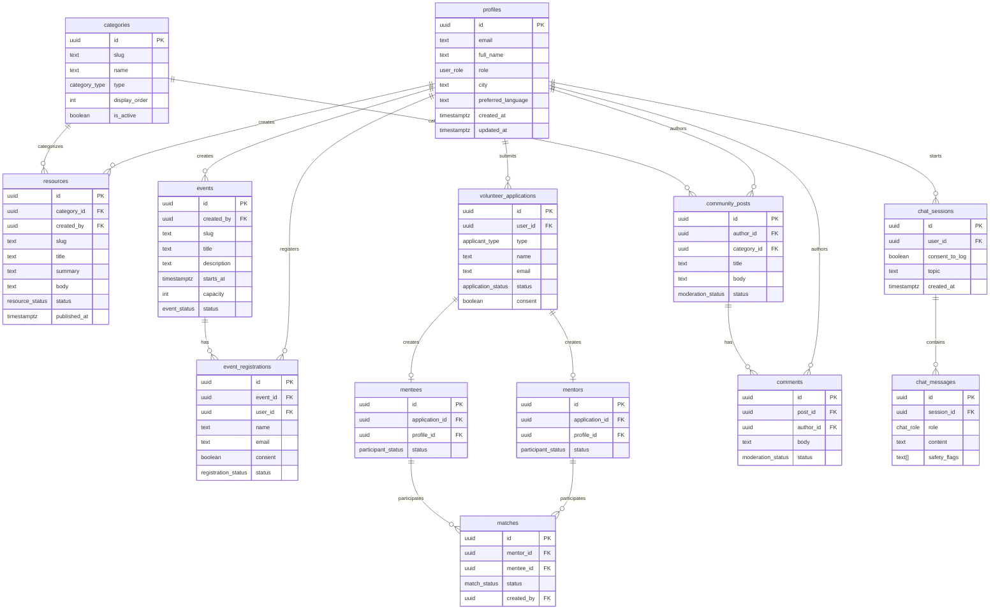

# COAN Database Design

Canadian Observers and Activists Network (COAN)

Target database: PostgreSQL on Supabase

## 1. Design Goals

The COAN database supports a nonprofit public-service platform for Chinese-speaking newcomers in Canada. The schema must handle public content, volunteer matching, events, community discussion, and consent-aware AI chat records.

Design goals:

- Normalize core entities.
- Preserve data integrity through foreign keys, enums, and constraints.
- Support Supabase Auth and Row Level Security.
- Scale toward production workloads.
- Keep private volunteer, event, and chat data protected.
- Allow future RAG, analytics, and admin review systems.
- Use PostgreSQL best practices and predictable naming.

## 2. Core Modules

Current required modules:

- Users
- Profiles
- Resources
- Events
- Event Registrations
- Volunteer Applications
- Mentors
- Mentees
- Matches
- Community Posts
- Comments
- Chat Sessions
- Chat Messages

Recommended supporting modules:

- Categories
- Languages
- Volunteer roles
- Application role preferences
- Audit fields
- Moderation status
- Resource source metadata
- Future resource embeddings

## 3. Design Principles

### Identity

Supabase Auth owns authentication in `auth.users`. The application stores public and operational profile metadata in `public.profiles`.

### Authorization

Authorization is enforced with:

- `profiles.role`
- Row Level Security policies
- Admin-only service operations through FastAPI when elevated privileges are required

### Content Modeling

Resources, events, posts, and comments are independent content entities with:

- Status fields
- Slugs where publicly addressable
- Author or creator references
- Audit timestamps

### Consent Modeling

Consent is explicit for:

- Volunteer applications
- Event registrations
- Chat logging

Sensitive data should be minimized and retained only as long as needed.

## 4. Entity Relationship Overview



## 5. Domain ERD



## 6. SQL Schema

This SQL is a production-oriented target schema. It can replace or evolve the current `supabase/schema.sql` through migrations.

```sql
create extension if not exists "pgcrypto";
create extension if not exists "citext";
create extension if not exists "pg_trgm";
-- Optional future extension if Supabase pgvector is used:
-- create extension if not exists "vector";

create type public.user_role as enum ('user', 'volunteer', 'admin');
create type public.category_type as enum ('resource', 'community', 'both');
create type public.resource_status as enum ('draft', 'reviewing', 'published', 'archived');
create type public.event_status as enum ('draft', 'published', 'cancelled', 'completed', 'archived');
create type public.registration_status as enum ('registered', 'waitlisted', 'cancelled', 'attended', 'no_show');
create type public.applicant_type as enum ('mentor', 'mentee', 'volunteer');
create type public.application_status as enum ('submitted', 'reviewing', 'approved', 'matched', 'inactive', 'rejected');
create type public.participant_status as enum ('active', 'inactive');
create type public.match_status as enum ('proposed', 'active', 'completed', 'inactive', 'rejected');
create type public.moderation_status as enum ('pending', 'published', 'hidden', 'removed');
create type public.chat_role as enum ('user', 'assistant', 'system', 'tool');

create table public.profiles (
  id uuid primary key references auth.users(id) on delete cascade,
  email citext not null unique,
  full_name text,
  display_name text,
  role public.user_role not null default 'user',
  city text,
  province text,
  preferred_language text,
  avatar_path text,
  created_at timestamptz not null default now(),
  updated_at timestamptz not null default now(),
  constraint profiles_email_not_blank check (length(trim(email::text)) > 0)
);

create table public.categories (
  id uuid primary key default gen_random_uuid(),
  slug text not null unique,
  name text not null,
  description text,
  type public.category_type not null default 'both',
  display_order int not null default 0,
  is_active boolean not null default true,
  created_at timestamptz not null default now(),
  updated_at timestamptz not null default now(),
  constraint categories_slug_format check (slug ~ '^[a-z0-9]+(?:-[a-z0-9]+)*$')
);

create table public.resources (
  id uuid primary key default gen_random_uuid(),
  category_id uuid not null references public.categories(id) on delete restrict,
  created_by uuid references public.profiles(id) on delete set null,
  reviewed_by uuid references public.profiles(id) on delete set null,
  title text not null,
  slug text not null unique,
  summary text not null,
  body text not null,
  source_url text,
  source_name text,
  language text not null default 'en',
  status public.resource_status not null default 'draft',
  published_at timestamptz,
  created_at timestamptz not null default now(),
  updated_at timestamptz not null default now(),
  constraint resources_slug_format check (slug ~ '^[a-z0-9]+(?:-[a-z0-9]+)*$'),
  constraint resources_published_at_required check (
    status <> 'published' or published_at is not null
  )
);

create table public.events (
  id uuid primary key default gen_random_uuid(),
  created_by uuid references public.profiles(id) on delete set null,
  title text not null,
  slug text not null unique,
  description text not null,
  starts_at timestamptz not null,
  ends_at timestamptz,
  timezone text not null default 'America/Toronto',
  location_name text,
  address text,
  online_link text,
  capacity int,
  registration_deadline timestamptz,
  status public.event_status not null default 'draft',
  created_at timestamptz not null default now(),
  updated_at timestamptz not null default now(),
  constraint events_slug_format check (slug ~ '^[a-z0-9]+(?:-[a-z0-9]+)*$'),
  constraint events_capacity_positive check (capacity is null or capacity > 0),
  constraint events_end_after_start check (ends_at is null or ends_at > starts_at)
);

create table public.event_registrations (
  id uuid primary key default gen_random_uuid(),
  event_id uuid not null references public.events(id) on delete cascade,
  user_id uuid references public.profiles(id) on delete set null,
  name text not null,
  email citext not null,
  city text,
  preferred_language text,
  accessibility_notes text,
  consent boolean not null default false,
  status public.registration_status not null default 'registered',
  created_at timestamptz not null default now(),
  updated_at timestamptz not null default now(),
  constraint event_registrations_email_not_blank check (length(trim(email::text)) > 0),
  constraint event_registrations_unique_email unique (event_id, email)
);

create table public.volunteer_roles (
  id uuid primary key default gen_random_uuid(),
  slug text not null unique,
  title text not null,
  description text not null,
  is_active boolean not null default true,
  created_at timestamptz not null default now()
);

create table public.volunteer_applications (
  id uuid primary key default gen_random_uuid(),
  user_id uuid references public.profiles(id) on delete set null,
  applicant_type public.applicant_type not null,
  name text not null,
  email citext not null,
  city text,
  province text,
  languages text[] not null default '{}',
  areas_of_support text[] not null default '{}',
  needs text,
  availability text,
  background text,
  urgency_level text,
  consent boolean not null default false,
  status public.application_status not null default 'submitted',
  admin_notes text,
  reviewed_by uuid references public.profiles(id) on delete set null,
  reviewed_at timestamptz,
  created_at timestamptz not null default now(),
  updated_at timestamptz not null default now(),
  constraint volunteer_applications_email_not_blank check (length(trim(email::text)) > 0),
  constraint volunteer_applications_consent_required check (consent = true)
);

create table public.volunteer_application_roles (
  application_id uuid not null references public.volunteer_applications(id) on delete cascade,
  role_id uuid not null references public.volunteer_roles(id) on delete restrict,
  primary key (application_id, role_id)
);

create table public.mentors (
  id uuid primary key default gen_random_uuid(),
  application_id uuid unique references public.volunteer_applications(id) on delete set null,
  profile_id uuid references public.profiles(id) on delete set null,
  name text not null,
  email citext not null,
  city text,
  province text,
  languages text[] not null default '{}',
  areas_of_support text[] not null default '{}',
  availability text,
  status public.participant_status not null default 'active',
  created_at timestamptz not null default now(),
  updated_at timestamptz not null default now()
);

create table public.mentees (
  id uuid primary key default gen_random_uuid(),
  application_id uuid unique references public.volunteer_applications(id) on delete set null,
  profile_id uuid references public.profiles(id) on delete set null,
  name text not null,
  email citext not null,
  city text,
  province text,
  preferred_language text,
  needs text,
  urgency_level text,
  status public.participant_status not null default 'active',
  created_at timestamptz not null default now(),
  updated_at timestamptz not null default now()
);

create table public.matches (
  id uuid primary key default gen_random_uuid(),
  mentor_id uuid not null references public.mentors(id) on delete cascade,
  mentee_id uuid not null references public.mentees(id) on delete cascade,
  status public.match_status not null default 'proposed',
  admin_notes text,
  created_by uuid references public.profiles(id) on delete set null,
  started_at timestamptz,
  ended_at timestamptz,
  created_at timestamptz not null default now(),
  updated_at timestamptz not null default now(),
  constraint matches_end_after_start check (ended_at is null or started_at is null or ended_at >= started_at),
  constraint matches_unique_active_pair unique (mentor_id, mentee_id, status)
);

create table public.community_posts (
  id uuid primary key default gen_random_uuid(),
  author_id uuid references public.profiles(id) on delete set null,
  category_id uuid not null references public.categories(id) on delete restrict,
  title text not null,
  body text not null,
  status public.moderation_status not null default 'pending',
  moderated_by uuid references public.profiles(id) on delete set null,
  moderated_at timestamptz,
  created_at timestamptz not null default now(),
  updated_at timestamptz not null default now()
);

create table public.comments (
  id uuid primary key default gen_random_uuid(),
  post_id uuid not null references public.community_posts(id) on delete cascade,
  author_id uuid references public.profiles(id) on delete set null,
  body text not null,
  status public.moderation_status not null default 'pending',
  moderated_by uuid references public.profiles(id) on delete set null,
  moderated_at timestamptz,
  created_at timestamptz not null default now(),
  updated_at timestamptz not null default now()
);

create table public.chat_sessions (
  id uuid primary key default gen_random_uuid(),
  user_id uuid references public.profiles(id) on delete set null,
  consent_to_log boolean not null default false,
  topic text,
  language text,
  client_context jsonb not null default '{}'::jsonb,
  created_at timestamptz not null default now(),
  updated_at timestamptz not null default now()
);

create table public.chat_messages (
  id uuid primary key default gen_random_uuid(),
  session_id uuid not null references public.chat_sessions(id) on delete cascade,
  role public.chat_role not null,
  content text not null,
  safety_flags text[] not null default '{}',
  source_metadata jsonb not null default '{}'::jsonb,
  created_at timestamptz not null default now()
);

-- Future RAG table if pgvector is enabled.
-- create table public.resource_chunks (
--   id uuid primary key default gen_random_uuid(),
--   resource_id uuid not null references public.resources(id) on delete cascade,
--   chunk_index int not null,
--   content text not null,
--   metadata jsonb not null default '{}'::jsonb,
--   embedding vector(1536),
--   created_at timestamptz not null default now(),
--   unique (resource_id, chunk_index)
-- );
```

## 7. Updated Timestamp Trigger

Use one reusable trigger for `updated_at`.

```sql
create or replace function public.set_updated_at()
returns trigger
language plpgsql
as $$
begin
  new.updated_at = now();
  return new;
end;
$$;

create trigger set_profiles_updated_at
before update on public.profiles
for each row execute function public.set_updated_at();

create trigger set_categories_updated_at
before update on public.categories
for each row execute function public.set_updated_at();

create trigger set_resources_updated_at
before update on public.resources
for each row execute function public.set_updated_at();

create trigger set_events_updated_at
before update on public.events
for each row execute function public.set_updated_at();

create trigger set_event_registrations_updated_at
before update on public.event_registrations
for each row execute function public.set_updated_at();

create trigger set_volunteer_applications_updated_at
before update on public.volunteer_applications
for each row execute function public.set_updated_at();

create trigger set_mentors_updated_at
before update on public.mentors
for each row execute function public.set_updated_at();

create trigger set_mentees_updated_at
before update on public.mentees
for each row execute function public.set_updated_at();

create trigger set_matches_updated_at
before update on public.matches
for each row execute function public.set_updated_at();

create trigger set_community_posts_updated_at
before update on public.community_posts
for each row execute function public.set_updated_at();

create trigger set_comments_updated_at
before update on public.comments
for each row execute function public.set_updated_at();

create trigger set_chat_sessions_updated_at
before update on public.chat_sessions
for each row execute function public.set_updated_at();
```

## 8. Seed Data Recommendations

Seed lookup data with deterministic slugs.

```sql
insert into public.categories (slug, name, type, display_order) values
  ('housing', 'Housing', 'both', 10),
  ('healthcare', 'Healthcare', 'both', 20),
  ('tax-and-benefits', 'Tax and benefits', 'both', 30),
  ('community-life', 'Community life', 'both', 40),
  ('public-policy', 'Public policy', 'both', 50),
  ('civic-engagement', 'Civic engagement', 'both', 60),
  ('student-support', 'Student support', 'both', 70);

insert into public.volunteer_roles (slug, title, description) values
  ('visual-designer', 'Visual Designer', 'Create accessible graphics and campaign visuals.'),
  ('content-translator', 'Content Translator', 'Translate public-service information into natural Chinese.'),
  ('video-editor-producer', 'Video Editor / Producer', 'Produce short educational videos and event recordings.'),
  ('social-media-operator', 'Social Media Operator', 'Publish updates and support community communications.'),
  ('web-designer-developer', 'Web Designer / Developer', 'Improve COAN digital products and admin workflows.'),
  ('mentor', 'Mentor', 'Support newcomers with practical orientation.'),
  ('community-volunteer', 'Community Volunteer', 'Help with events, outreach, and resource collection.');
```

## 9. Index Recommendations

Indexes should match access patterns. Avoid indexing every column by default.

### Identity and Profiles

```sql
create index profiles_role_idx on public.profiles (role);
create index profiles_city_idx on public.profiles (city);
```

### Categories

```sql
create index categories_type_active_idx on public.categories (type, is_active, display_order);
```

### Resources

Access patterns:

- Public resource list by published status, category, date.
- Admin list by status.
- Search by title, summary, body.
- Lookup by slug.

```sql
create index resources_status_published_at_idx on public.resources (status, published_at desc);
create index resources_category_status_idx on public.resources (category_id, status);
create index resources_created_by_idx on public.resources (created_by);
create index resources_title_trgm_idx on public.resources using gin (title gin_trgm_ops);
create index resources_summary_trgm_idx on public.resources using gin (summary gin_trgm_ops);
```

Optional full-text search:

```sql
create index resources_fts_idx on public.resources
using gin (
  to_tsvector('english', coalesce(title, '') || ' ' || coalesce(summary, '') || ' ' || coalesce(body, ''))
);
```

### Events and Registrations

```sql
create index events_status_starts_at_idx on public.events (status, starts_at);
create index events_created_by_idx on public.events (created_by);
create index event_registrations_event_status_idx on public.event_registrations (event_id, status);
create index event_registrations_user_idx on public.event_registrations (user_id);
create index event_registrations_email_idx on public.event_registrations (email);
```

### Volunteer Applications and Matching

```sql
create index volunteer_applications_status_created_idx on public.volunteer_applications (status, created_at desc);
create index volunteer_applications_type_status_idx on public.volunteer_applications (applicant_type, status);
create index volunteer_applications_email_idx on public.volunteer_applications (email);
create index volunteer_application_roles_role_idx on public.volunteer_application_roles (role_id);
create index mentors_status_city_idx on public.mentors (status, city);
create index mentees_status_city_idx on public.mentees (status, city);
create index matches_status_created_idx on public.matches (status, created_at desc);
create index matches_mentor_idx on public.matches (mentor_id);
create index matches_mentee_idx on public.matches (mentee_id);
```

### Community

```sql
create index community_posts_status_created_idx on public.community_posts (status, created_at desc);
create index community_posts_category_status_idx on public.community_posts (category_id, status);
create index community_posts_author_idx on public.community_posts (author_id);
create index comments_post_created_idx on public.comments (post_id, created_at);
create index comments_status_created_idx on public.comments (status, created_at desc);
create index comments_author_idx on public.comments (author_id);
```

### Chat

```sql
create index chat_sessions_user_created_idx on public.chat_sessions (user_id, created_at desc);
create index chat_sessions_consent_created_idx on public.chat_sessions (consent_to_log, created_at desc);
create index chat_sessions_topic_idx on public.chat_sessions (topic);
create index chat_messages_session_created_idx on public.chat_messages (session_id, created_at);
create index chat_messages_safety_flags_idx on public.chat_messages using gin (safety_flags);
```

### Future Vector Search

If using pgvector:

```sql
-- create index resource_chunks_resource_idx on public.resource_chunks (resource_id);
-- create index resource_chunks_embedding_idx
-- on public.resource_chunks
-- using ivfflat (embedding vector_cosine_ops)
-- with (lists = 100);
```

## 10. Access Control Considerations

### Admin Helper Function

```sql
create or replace function public.is_admin()
returns boolean
language sql
security definer
set search_path = public
as $$
  select exists (
    select 1
    from public.profiles
    where id = auth.uid()
      and role = 'admin'
  );
$$;
```

### RLS Enablement

```sql
alter table public.profiles enable row level security;
alter table public.categories enable row level security;
alter table public.resources enable row level security;
alter table public.events enable row level security;
alter table public.event_registrations enable row level security;
alter table public.volunteer_roles enable row level security;
alter table public.volunteer_applications enable row level security;
alter table public.volunteer_application_roles enable row level security;
alter table public.mentors enable row level security;
alter table public.mentees enable row level security;
alter table public.matches enable row level security;
alter table public.community_posts enable row level security;
alter table public.comments enable row level security;
alter table public.chat_sessions enable row level security;
alter table public.chat_messages enable row level security;
```

### Public Read Policies

```sql
create policy "public read active categories"
on public.categories for select
using (is_active = true or public.is_admin());

create policy "public read published resources"
on public.resources for select
using (status = 'published' or public.is_admin());

create policy "public read published events"
on public.events for select
using (status = 'published' or public.is_admin());

create policy "public read published community posts"
on public.community_posts for select
using (status = 'published' or author_id = auth.uid() or public.is_admin());

create policy "public read published comments"
on public.comments for select
using (status = 'published' or author_id = auth.uid() or public.is_admin());
```

### User Ownership Policies

```sql
create policy "profiles read own or admin"
on public.profiles for select
using (id = auth.uid() or public.is_admin());

create policy "profiles update own or admin"
on public.profiles for update
using (id = auth.uid() or public.is_admin())
with check (id = auth.uid() or public.is_admin());

create policy "authenticated create community posts"
on public.community_posts for insert
with check (author_id = auth.uid());

create policy "authors update own community posts"
on public.community_posts for update
using (author_id = auth.uid() or public.is_admin())
with check (author_id = auth.uid() or public.is_admin());

create policy "authenticated create comments"
on public.comments for insert
with check (author_id = auth.uid());
```

### Admin Management Policies

```sql
create policy "admins manage resources"
on public.resources for all
using (public.is_admin())
with check (public.is_admin());

create policy "admins manage events"
on public.events for all
using (public.is_admin())
with check (public.is_admin());

create policy "admins manage volunteer applications"
on public.volunteer_applications for all
using (public.is_admin())
with check (public.is_admin());

create policy "admins manage mentors"
on public.mentors for all
using (public.is_admin())
with check (public.is_admin());

create policy "admins manage mentees"
on public.mentees for all
using (public.is_admin())
with check (public.is_admin());

create policy "admins manage matches"
on public.matches for all
using (public.is_admin())
with check (public.is_admin());
```

### Consent-Based Insert Policies

```sql
create policy "public register for events with consent"
on public.event_registrations for insert
with check (consent = true);

create policy "public submit volunteer applications with consent"
on public.volunteer_applications for insert
with check (consent = true);
```

### Chat Access Policies

```sql
create policy "users create own chat sessions"
on public.chat_sessions for insert
with check (user_id is null or user_id = auth.uid());

create policy "admins view consented chat sessions"
on public.chat_sessions for select
using (public.is_admin() and consent_to_log = true);

create policy "users create consented chat messages"
on public.chat_messages for insert
with check (
  exists (
    select 1
    from public.chat_sessions
    where chat_sessions.id = session_id
      and chat_sessions.consent_to_log = true
      and (chat_sessions.user_id is null or chat_sessions.user_id = auth.uid())
  )
);

create policy "admins view consented chat messages"
on public.chat_messages for select
using (
  public.is_admin()
  and exists (
    select 1
    from public.chat_sessions
    where chat_sessions.id = session_id
      and chat_sessions.consent_to_log = true
  )
);
```

## 11. PostgreSQL Best Practices Applied

### Use UUID Primary Keys

UUIDs avoid exposing sequential IDs and work well across distributed services, imports, and future background jobs.

### Use Enums for Stable State Machines

Enums are appropriate for stable states such as:

- User roles
- Resource status
- Event status
- Registration status
- Moderation status
- Chat role

If the state list becomes highly configurable, move it into lookup tables later.

### Use `citext` for Emails

Emails should compare case-insensitively. `citext` prevents duplicate emails with different casing.

### Use Explicit Timestamps

Every operational table should include:

- `created_at`
- `updated_at` when records are editable
- `published_at`, `reviewed_at`, `moderated_at`, `started_at`, or `ended_at` where domain-specific lifecycle events matter

### Prefer Restrict Deletes for Shared Lookup Data

Categories and roles use `on delete restrict` so historical content is not orphaned accidentally.

### Use Cascade Deletes for Owned Child Rows

Examples:

- Event deletes cascade to registrations.
- Community post deletes cascade to comments.
- Chat session deletes cascade to messages.

### Avoid Storing Secrets

Do not store:

- OpenAI API keys
- Supabase service keys
- OAuth tokens
- Payment details

Secrets belong in environment variables or a secure secrets manager.

## 12. Data Retention and Privacy

Recommended retention rules:

| Data | Suggested Retention |
| --- | --- |
| Volunteer applications | Archive after 24 months inactive |
| Rejected applications | Delete or anonymize after 12 months |
| Event registrations | Retain 18 months for reporting, then anonymize |
| Chat sessions without consent | Do not store message content |
| Chat sessions with consent | Retain 6-12 months for quality review |
| Hidden community content | Retain moderation metadata, limit public visibility |

Privacy principles:

- Minimize sensitive fields.
- Store chat content only with consent.
- Keep admin notes private.
- Avoid collecting immigration, medical, financial, or legal details unless necessary.
- Add audit logging before production admin workflows.

## 13. Future Scalability

### Analytics Tables

Future tables:

- `page_views`
- `resource_events`
- `search_queries`
- `chat_feedback`
- `event_attendance_metrics`

Store aggregate analytics where possible to reduce privacy risk.

### Audit Logs

Recommended future table:

```sql
create table public.audit_logs (
  id uuid primary key default gen_random_uuid(),
  actor_id uuid references public.profiles(id) on delete set null,
  action text not null,
  entity_type text not null,
  entity_id uuid,
  metadata jsonb not null default '{}'::jsonb,
  created_at timestamptz not null default now()
);
```

### RAG and Evaluation Tables

Future tables:

- `resource_chunks`
- `chat_retrievals`
- `chat_feedback`
- `ai_evaluations`
- `evaluation_runs`

These should remain separate from operational content tables so AI experimentation does not destabilize core nonprofit workflows.

## 14. Migration Strategy

Recommended migration order:

1. Extensions and enums.
2. Lookup tables: categories, volunteer roles.
3. Profiles.
4. Content tables: resources, events.
5. Registration and volunteer application tables.
6. Mentor, mentee, and matching tables.
7. Community tables.
8. Chat tables.
9. Indexes.
10. Triggers.
11. RLS enablement.
12. RLS policies.
13. Seed data.

Migration rules:

- Run migrations in a staging Supabase project first.
- Add indexes after initial table creation.
- Add RLS policies before exposing frontend writes.
- Backfill required columns before adding `not null` constraints in existing production data.
- Use transaction-wrapped migrations where possible.

## 15. Interview Talking Points

This database design demonstrates:

- Normalized relational modeling for a real nonprofit platform.
- Clear separation between Supabase Auth identity and app profile data.
- Production-oriented state modeling with PostgreSQL enums.
- Consent-aware handling of volunteer, event, and chatbot records.
- RLS-first access control.
- Indexes based on realistic query patterns.
- Future-ready extension points for vector search, RAG, evaluation, analytics, and audit logs.
- Careful handling of community moderation and sensitive newcomer data.
